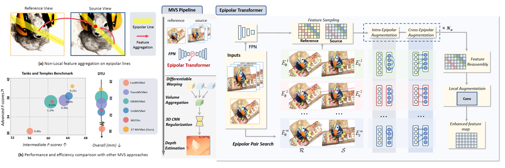

> The code will be released soon.

# ET-MVSNet

## [Paper]() | [Project Page]() | [Arxiv]()

> [When Epipolar Constraint Meets Non-local Operators in Multi-View Stereo]()  
> Authors: Tianqi Liu, Xinyi Ye, Weiyue Zhao, Zhiyu Pan, Min Shi*, Zhiguo Cao  
> Institute: Huazhong University of Science and Technology  
> ICCV 2023  

## Abstract
Learning-based multi-view stereo (MVS) method heavily relies on feature matching, which requires distinctive and descriptive representations. An effective solution is to apply non-local feature aggregation, e.g., Transformer. Albeit useful, these techniques introduce heavy computation overheads for MVS. Each pixel densely attends to the whole image. In contrast, we propose to constrain non-local feature augmentation within a pair of lines: each point only attends the corresponding pair of epipolar lines. Our idea takes inspiration from the classic epipolar geometry, which shows that one point with different depth hypotheses will be projected to the epipolar line on the other view. This constraint reduces the 2D search space into the epipolar line in stereo matching. Similarly, this suggests that the matching of MVS is to distinguish a series of points lying on the same line. Inspired by this point-to-line search, we devise a line-to-point non-local augmentation strategy. We first devise an optimized searching algorithm to split the 2D feature maps into epipolar line pairs. Then, an Epipolar Transformer (ET) performs non-local feature augmentation among epipolar line pairs. We incorporate the ET into a learning-based MVS baseline, named ET-MVSNet. ET-MVSNet achieves state-of-the-art reconstruction performance on both the DTU and Tanks-and-Temples benchmark with high efficiency.

