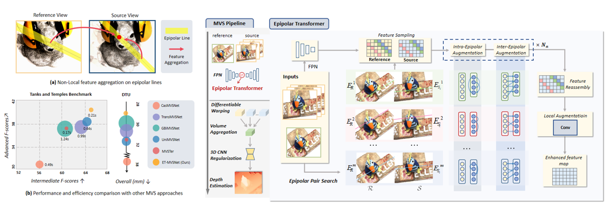

# ET-MVSNet

## [Paper](https://openaccess.thecvf.com/content/ICCV2023/html/Liu_When_Epipolar_Constraint_Meets_Non-Local_Operators_in_Multi-View_Stereo_ICCV_2023_paper.html) | [Arxiv](https://arxiv.org/abs/2309.17218) | [Model](https://drive.google.com/drive/folders/1sXAR8Y91oahH0n3dgpJDT51i8mGr6rtZ?usp=drive_link)

> When Epipolar Constraint Meets Non-local Operators in Multi-View Stereo  
> Authors: Tianqi Liu, Xinyi Ye, Weiyue Zhao, Zhiyu Pan, Min Shi<sup>*</sup>, Zhiguo Cao  
> Institute: Huazhong University of Science and Technology  
> ICCV 2023  

## Abstract
Learning-based multi-view stereo (MVS) method heavily relies on feature matching, which requires distinctive and descriptive representations. An effective solution is to apply non-local feature aggregation, e.g., Transformer. Albeit useful, these techniques introduce heavy computation overheads for MVS. Each pixel densely attends to the whole image. In contrast, we propose to constrain non-local feature augmentation within a pair of lines: each point only attends the corresponding pair of epipolar lines. Our idea takes inspiration from the classic epipolar geometry, which shows that one point with different depth hypotheses will be projected to the epipolar line on the other view. This constraint reduces the 2D search space into the epipolar line in stereo matching. Similarly, this suggests that the matching of MVS is to distinguish a series of points lying on the same line. Inspired by this point-to-line search, we devise a line-to-point non-local augmentation strategy. We first devise an optimized searching algorithm to split the 2D feature maps into epipolar line pairs. Then, an Epipolar Transformer (ET) performs non-local feature augmentation among epipolar line pairs. We incorporate the ET into a learning-based MVS baseline, named ET-MVSNet. ET-MVSNet achieves state-of-the-art reconstruction performance on both the DTU and Tanks-and-Temples benchmark with high efficiency.
<p align="center">

</p>


## Installation

```bash
conda create -n etmvsnet python=3.10.8
conda activate etmvsnet
pip install -r requirements.txt
pip install torch==1.13.1+cu116 torchvision==0.14.1+cu116 torchaudio==0.13.1 -f https://download.pytorch.org/whl/torch_stable.html
```

## Data Preparation

#### 1. DTU Dataset

**Training data**. We use the same DTU training data as mentioned in MVSNet and CasMVSNet. Download [DTU training data](https://drive.google.com/file/d/1eDjh-_bxKKnEuz5h-HXS7EDJn59clx6V/view) and [Depth raw](https://virutalbuy-public.oss-cn-hangzhou.aliyuncs.com/share/cascade-stereo/CasMVSNet/dtu_data/dtu_train_hr/Depths_raw.zip). Unzip and organize them as:
```
dtu_training                     
    ├── Cameras                
    ├── Depths   
    ├── Depths_raw
    └── Rectified
```


**Testing Data**. Download [DTU testing data](https://drive.google.com/file/d/135oKPefcPTsdtLRzoDAQtPpHuoIrpRI_/view). Unzip it as:
```
dtu_testing                                       
    ├── scan1   
    ├── scan4
    ├── ...
```

#### 2. BlendedMVS Dataset

Download [BlendedMVS](https://drive.google.com/file/d/1ilxls-VJNvJnB7IaFj7P0ehMPr7ikRCb/view) and unzip it as:

```
blendedmvs                          
    ├── 5a0271884e62597cdee0d0eb                
    ├── 5a3ca9cb270f0e3f14d0eddb   
    ├── ...
    ├── training_list.txt
    ├── ...
```

#### 3. Tanks and Temples Dataset

Download [Tanks and Temples](https://drive.google.com/file/d/1YArOJaX9WVLJh4757uE8AEREYkgszrCo/view) and  unzip it as:
```
tanksandtemples                          
       ├── advanced                 
       │   ├── Auditorium       
       │   ├── ...  
       └── intermediate
           ├── Family       
           ├── ...          
```
We use the camera parameters of short depth range version (included in your download), you should replace the `cams` folder in `intermediate` folder with the short depth range version manually.

Or you can download our processed data [here](https://drive.google.com/file/d/17mTgTzjPV1KsazabRIU0J3p0_ogufi5R/view?usp=sharing).

We recommend the latter.


## Training

### Training on DTU

To train the model from scratch on DTU, specify ``DTU_TRAINING`` in ``./scripts/train_dtu.sh`` first and then run:
```
bash scripts/train_dtu.sh exp_name
```
After training, you will get model checkpoints in `./checkpoints/dtu/exp_name`.

### Finetune on BlendedMVS

To fine-tune the model on BlendedMVS, you need specify `BLD_TRAINING` and `BLD_CKPT_FILE` in `./scripts/train_bld.sh` first, then run:
```
bash scripts/train_bld.sh exp_name
```


## Testing

### Testing on DTU

For DTU testing, we use the model ([pretrained model](https://drive.google.com/file/d/1D82VEWimgnB_cDwrUGJaIZTEXU0v--Xf/view?usp=drive_link)) trained on DTU training dataset. Specify `DTU_TESTPATH` and `DTU_CKPT_FILE` in `./scripts/test_dtu.sh` first, then run the following command to generate point cloud results.
```
bash scripts/test_dtu.sh exp_name
```
For quantitative evaluation, download [SampleSet](http://roboimagedata.compute.dtu.dk/?page_id=36) and [Points](http://roboimagedata.compute.dtu.dk/?page_id=36) from DTU's website. Unzip them and place `Points` folder in `SampleSet/MVS Data/`. The structure is just like:
```
SampleSet
├──MVS Data
      └──Points
```

Specify `datapath`, `plyPath`, `resultsPath` in `evaluations/dtu/BaseEvalMain_web.m` and `datapath`, `resultsPath` in `evaluations/dtu/ComputeStat_web.m`, then run the following command to obtain the quantitative metics.
```
cd evaluations/dtu
matlab -nodisplay
BaseEvalMain_web 
ComputeStat_web
```

### Testing on Tanks and Temples
We recommend using the finetuned model ([pretrained model](https://drive.google.com/file/d/1T-e09S5Dd6I0x9CATPHYV143L-w8NEsF/view?usp=drive_link)) to test on Tanks and Temples benchmark. Similarly, specify `TNT_TESTPATH` and `TNT_CKPT_FILE` in `scripts/test_tnt_inter.sh` and `scripts/test_tnt_adv.sh`. To generate point cloud results, just run:
```
bash scripts/test_tnt_inter.sh exp_name
```
```
bash scripts/test_tnt_adv.sh exp_name
``` 
For quantitative evaluation, you can upload your point clouds to [Tanks and Temples benchmark](https://www.tanksandtemples.org/).

## Citation
```bibtex
@InProceedings{Liu_2023_ICCV,
    author    = {Liu, Tianqi and Ye, Xinyi and Zhao, Weiyue and Pan, Zhiyu and Shi, Min and Cao, Zhiguo},
    title     = {When Epipolar Constraint Meets Non-Local Operators in Multi-View Stereo},
    booktitle = {Proceedings of the IEEE/CVF International Conference on Computer Vision (ICCV)},
    month     = {October},
    year      = {2023},
    pages     = {18088-18097}
```


## Acknowledgements
Our work is partially based on these opening source work: [MVSNet](https://github.com/YoYo000/MVSNet), [cascade-stereo](https://github.com/alibaba/cascade-stereo), [MVSTER](https://github.com/JeffWang987/MVSTER).

We appreciate their contributions to the MVS community.
